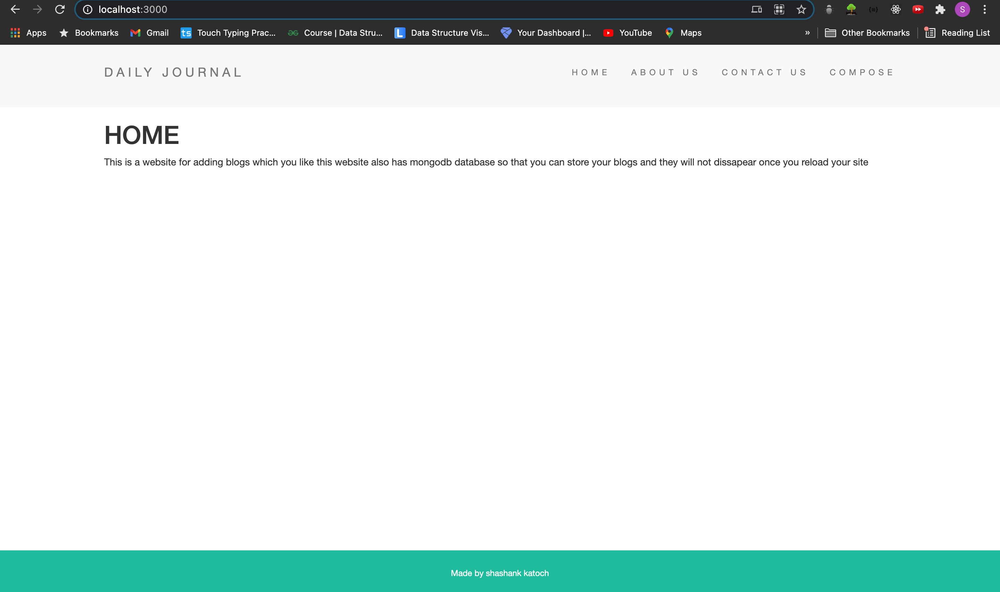

# BLOG SITE

This site is made using an express server it also incorporates ejs templates, and mongodb database so that you can store your blogs.

After forking or copying the project you can run it by typing nodemon app.js or node app.js.

Here is the screenshot of the site :-

